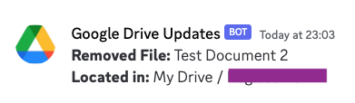

# Google Drive File Tracker

This Google Apps Script monitors changes to files in a specified Google Drive folder and reports added or removed files to a Discord channel using a webhook. The script runs at regular intervals and compares the current state of the drive with the previous state, identifying any changes.

## Setup Instructions

### 1. Google Drive Setup

- Create a Google Drive folder that you want to monitor.
- Replace the `folderId` variable in the `getDriveStructure` function with the ID of the starting folder.
- Alternatively, if you want to monitor the entire drive of an account just leave the id as "root"

### 2. Discord Webhook Setup

- Create a Discord channel where updates will be posted.
- Obtain a Discord webhook URL for the channel.

### 3. Google Apps Script Setup

- Open the [Google Apps Script](https://script.google.com/) editor.
- Create a new project.
- Copy and paste the provided script into the editor.

### 4. Configure Script

- Replace the `discordWebhookUrl` variable in the `postUpdatesToDiscord` function with your Discord webhook URL.

### 5. Set Trigger for Recurring Execution

- In the Google Apps Script editor, click on the clock icon on the left sidebar.
- Create a new trigger.
- Choose the `updateDriveStructure` function to run every 5 minutes or your preferred interval.

> Try running the script once manually and check how long it takes for your drive usually it is around 30 seconds

### 7. Review and Adjust Permissions

- Ensure that the script has the necessary permissions to access your Google Drive and post messages to Discord.

### 8. Run the Script

- Run the `updateDriveStructure` function manually for the first time to initialize the previous drive structure.

## Important Note

- **IMPORTANT:** COMMENT OUT `postUpdatesToDiscord(removedFiles, addedFiles);` (Line 12) WHEN RUNNING FOR THE FIRST TIME

> this will ensure that the drive structure is stored in the scripts memory initially. when the script is run for the first time the state changes from "no files in drive" to "all files in drive" which will spam the webhook.

- **Security:** Keep your Discord webhook URL and Google Drive structure private. Avoid sharing these details in your script or public repositories.
- **Permissions:** Review and understand the permissions required by the script before authorizing it.

## Disclaimer

This script is provided as-is, and the author takes no responsibility for any data loss or unauthorized access. Use it at your own risk and ensure you understand its functionality and implications.
